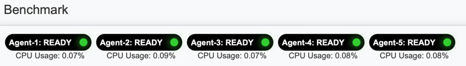

BM performance tester
======
> Since 2024.03.07

A enterprise level performance testing solution. Taking inspiration from [nGrinder](https://github.com/naver/ngrinder), this project aims to develop a Spring Boot application mirroring nGrinder’s functionality as closely as possible.

You can use our service in [https://www.high-load.org](https://www.high-load.org).

BM has 2 major components.
* **bm-controller**
  > A web application that manage test templates, user, groups, etc. Enables the performance tester to run its test.
* **bm-agent**
  > A scalable performance tester that create the number of vuser threads, send HTTP load to target server.

And for user who confiuring own service, eureka server is used in service discovery purpose.

## Features
* Scalable bm-agent by advertising to eureka server.
* Run multiple tests concurrently and easy check agent status and their cpu usage.
* Monitoring test intermediate results.
* Register your test template like url, concurrent user, duration, etc. and run it. All test template is belong to group and anyone who join that group can see the result of performance test.
* Provide TPS, MTTFB percentile with p99.9, p99, p95, p90, p50.

## What we concerned

* **High HTTP request durability**

Our service should handle high load of HTTP request since our project name is performance tester. To handle multiple HTTP request, we choose webClient (which is a reactor based library). WebClient has a Netty based async non+blocking architecture, so it is a perfect solution.

But, **we cannot control concurrency level of webClient**. Because webClient itself provide full concurrency with no limit and no option for limit concurrency.

Because of that reason, **we create thread as much as the number of vuser and send webClient and blocking them**. So requests are performed in parallel as many vusers and are also blocked. We used this method to control the concurrency level.

* **Scalable bm-agent & Real-time agent status observer**

bm-agent is an application that actually transmits HTTP to the target server. 
And we observe that this bm-agent consume heavy load and need to distribute the load by making it scalable across multiple worker nodes. And the bm-controller should be noticed the scaled in/out of the corresponding bm-agent.

So, we configured the scheduler to notify not only the currently connected bm-agent but also new bm-agent through service discovery in every second.  Service discovery in the currently deployed production uses the K8S API through the `spring-cloud-kubernetes-client` library (in the docker compose distribution, service discovery is implemented through eureka).

* **Concurrency**

Again, since our application consume heavy cpu resource, concurrency is a major consideration. So we separate major logics(calculation, saving intermediate result, sse, etc.) using multiple threads and [schedulers](https://github.com/backend-tech-forge/benchmark/issues/61). We use CompletableFuture for running logics with async non-blocking.

* **Resource management**

We use multiple threads and schedulers and here, managing their resource is important(when job finished or stop, shutdown all related schedulers and threads). So we implement composite shutdown logic.

* **Automation**

We also consider automation for continuous integration and deployment. see [#34](https://github.com/backend-tech-forge/benchmark/issues/34) 

## Quick start

You can configure your own service with docker compose file.

Run `docker compose up` in project root directory! We already make an example docker compose files for you.

Instead of kubernetes service discovery, we provide eureka service for someone who don't use kubernetes.
